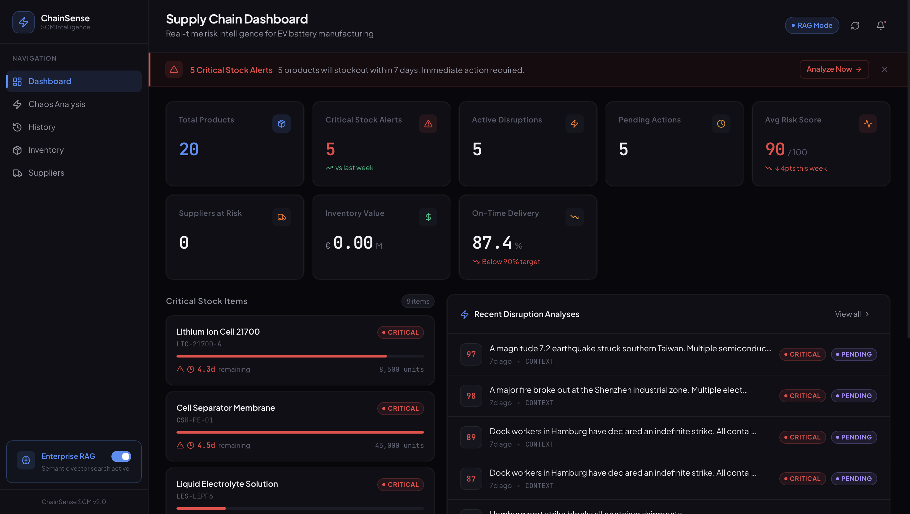
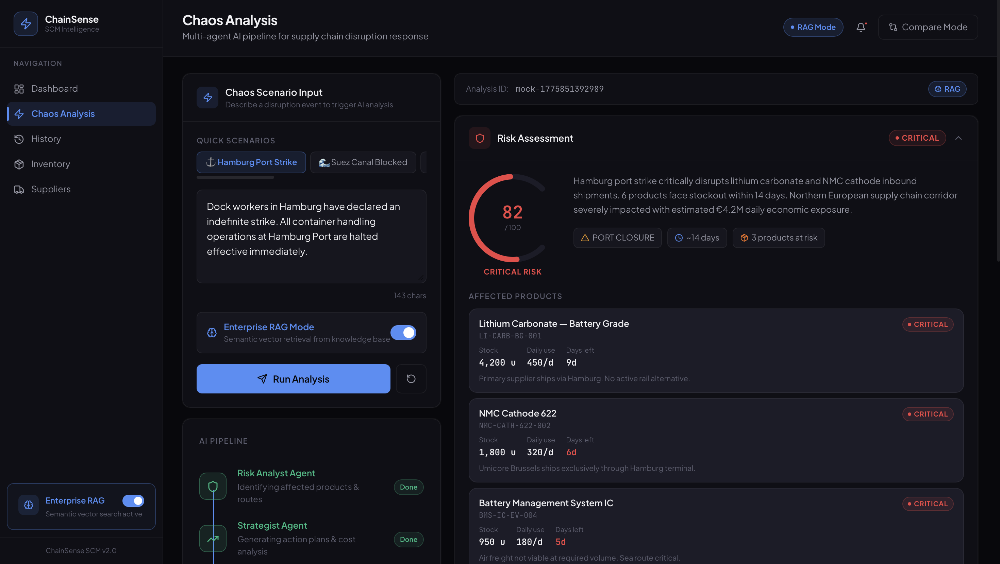
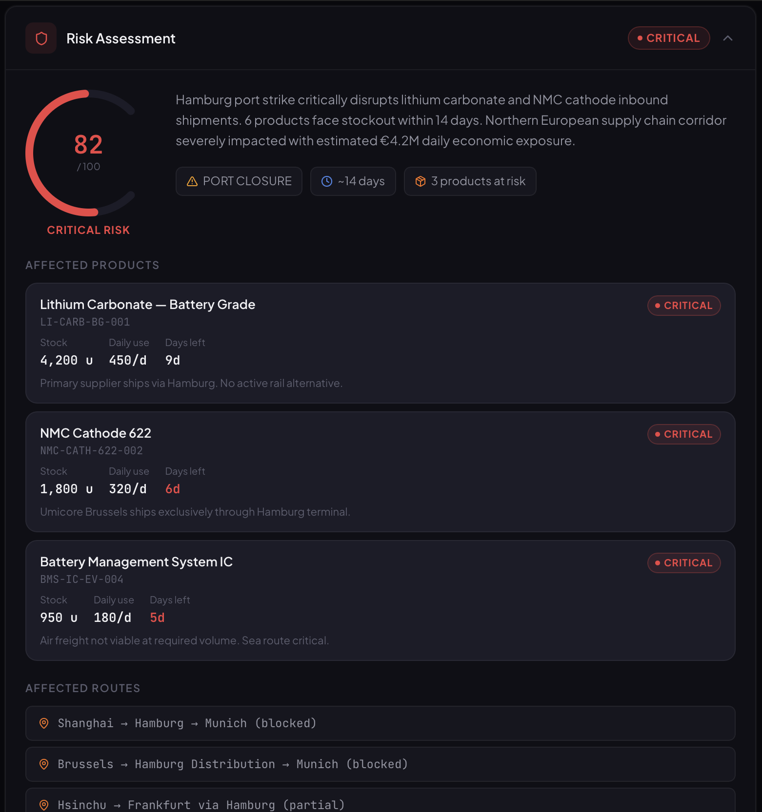
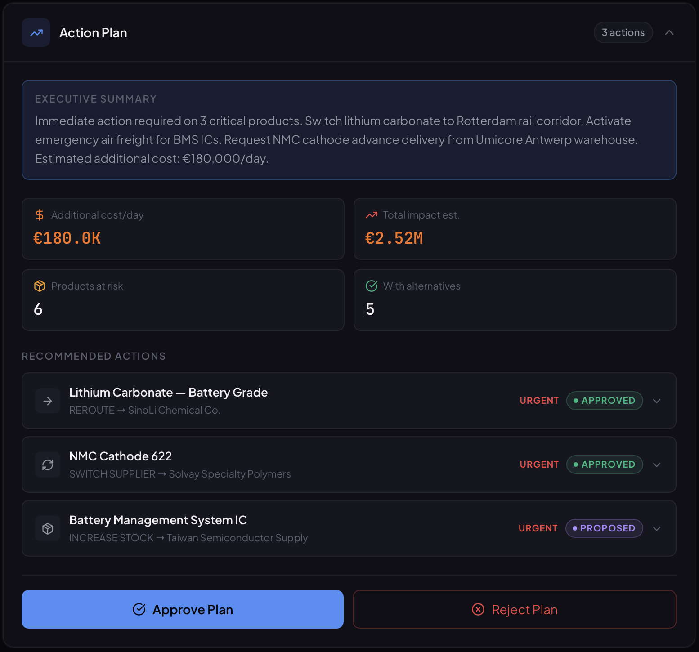

# ChainSense SCM


> Multi-agent AI-powered supply chain risk management platform for EV battery manufacturers. Two autonomous AI agents collaborate to detect disruptions, assess risks, and generate actionable recovery plans - in seconds, not hours.

## The Problem

Global supply chains are fragile. A port strike in Hamburg, an earthquake in Taiwan, or a canal blockage at Suez can halt an entire EV battery production line within days. Traditional ERP systems react to disruptions *after* they've already caused damage.

**ChainSense SCM is proactive.** Describe a crisis in plain language, and the system autonomously identifies affected products, calculates risk scores, finds alternative suppliers, and produces a one-click action plan.

## Live Demo

Access code: `TUM2026`

> Deployment coming soon via DigitalOcean (Student Pack).

## How It Works

```
User: "Hamburg port workers are on indefinite strike"
                │
                ▼
┌───────────────────────────────┐
│     Agent 1: Risk Analyst     │
│  • Queries product database   │
│  • Identifies affected routes │
│  • Calculates risk scores     │
│  • Output: structured report  │
└───────────────┬───────────────┘
                │ RiskReport (typed JSON)
                ▼
┌───────────────────────────────┐
│    Agent 2: Strategist        │
│  • Receives risk report       │
│  • Finds alternative suppliers│
│  • Compares costs & timelines │
│  • Output: prioritized plan   │
└───────────────┬───────────────┘
                │ ActionPlan (typed JSON)
                ▼
┌───────────────────────────────┐
│   Dashboard: Review & Decide  │
│  • Approve / Reject actions   │
│  • Full audit trail (DB log)  │
│  • What-If scenario compare   │
└───────────────────────────────┘
```

## Hybrid Retrieval Architecture

ChainSense supports two retrieval modes, switchable via a UI toggle:

| Mode | How It Works | When to Use |
|------|-------------|-------------|
| **Standard** | Direct SQL → text serialization → LLM context injection | Reliable, fast, deterministic |
| **Enterprise RAG** | pgvector semantic search → top-K retrieval → LLM context | Demonstrates enterprise-scale vector search |

Both modes produce identical typed output. The **Strategy Pattern** ensures agents are retrieval-mode agnostic - swap the retrieval implementation without touching agent logic.

## Screenshots

<table>
  <tr>
    <td align="center"><br/><sub>Dashboard - real-time KPIs + critical stock alerts</sub></td>
    <td align="center"><br/><sub>Chaos Analysis - 3-step AI pipeline visualization</sub></td>
  </tr>
  <tr>
    <td align="center"><br/><sub>Risk Report - affected products, routes, scores</sub></td>
     <td align="center"><br/><sub>Action Plan - cost analysis + approve/reject</sub></td>
  </tr>
</table>

## Tech Stack

### Backend
| Layer | Technology |
|-------|-----------|
| Language | Java 21 |
| Framework | Spring Boot 4.0.5 |
| AI Framework | Spring AI 2.0.0-M4 |
| LLM | Google Gemini 2.5 Flash (via OpenAI-compatible endpoint) |
| Embeddings | Gemini `gemini-embedding-001` (3072 dimensions) |
| Database | PostgreSQL 17 + pgvector extension |
| Migrations | Flyway |
| Vector Store | Custom PgVectorStore (sequential scan, 3072-dim) |
| Testing | JUnit 5 + Mockito - 24 tests, all green |

### Frontend
| Layer | Technology |
|-------|-----------|
| Framework | React 19 + TypeScript |
| Build Tool | Vite |
| Animations | Framer Motion |
| Icons | Lucide React |
| Components | Radix UI Primitives |

### Infrastructure
| Component | Service |
|-----------|---------|
| Database | Supabase PostgreSQL (pgvector enabled) |
| Hosting | DigitalOcean (Student Pack) |
| Container | Docker multi-stage build |

## Getting Started

### Prerequisites

- Java 21+
- Node.js 20+
- Docker Desktop
- Gemini API key ([get one free](https://aistudio.google.com/apikey))

### Backend

```bash
git clone https://github.com/alpgi1/chainsense-scm.git
cd chainsense-scm/backend

# Start PostgreSQL with pgvector
docker compose up -d

# Run the API
GEMINI_API_KEY=your_key_here ./mvnw spring-boot:run

# Health check
curl http://localhost:8080/api/v1/health
```

### Frontend

```bash
cd chainsense-scm/chainsense-frontend
npm install
npm run dev
# Open http://localhost:5173 - Access Code: TUM2026
```

The frontend auto-detects the backend at `http://localhost:8080/api/v1`. If the backend is unavailable, it falls back to realistic mock data so the UI remains fully explorable.

### Run Tests

```bash
cd backend
./mvnw test
# 24 tests across 6 test classes - all green
```

## Data Model

EV battery production line scenario:

- **30 suppliers** across 15 regions - China, South Korea, Japan, Germany, Poland, USA
- **20 products** - complete battery pack BOM (cells, BMS chips, separators, wiring, cooling, structural)
- **Realistic supply routes** - Hamburg, Rotterdam, Suez Canal, trans-Siberian rail, road freight
- **50+ supply chain embeddings** - ingested into pgvector on first startup for RAG mode

## Architecture Decisions

| Decision | Choice | Rationale |
|----------|--------|-----------|
| AI Framework | Spring AI (not LangChain4j) | Native Spring Boot integration, provider-swappable |
| Retrieval | Hybrid: Context Injection + RAG | CI for reliability; RAG for enterprise-scale showcase |
| Agent Communication | Typed DTOs | Structured pipeline without message queue overhead |
| Frontend | React SPA (not Next.js) | No SSR needed for a dashboard; Vite gives fast DX |
| Vector DB | pgvector (not Pinecone) | Same PostgreSQL instance - zero extra infrastructure |
| Embeddings | 3072-dim (no HNSW index) | Exceeds pgvector HNSW 2000-dim limit; sequential scan sufficient for 50 docs |

## API Reference

| Method | Endpoint | Description |
|--------|----------|-------------|
| `POST` | `/api/v1/disruptions/analyze` | Run multi-agent analysis on a disruption prompt |
| `POST` | `/api/v1/disruptions/compare` | Parallel What-If comparison of two scenarios |
| `GET` | `/api/v1/disruptions` | Paginated analysis history |
| `GET` | `/api/v1/disruptions/{id}` | Single disruption detail |
| `PATCH` | `/api/v1/disruptions/{id}/actions/{actionId}` | Approve or reject a recommended action |
| `GET` | `/api/v1/dashboard` | Aggregated KPIs, inventory alerts, recent disruptions |
| `GET` | `/api/v1/inventory` | Full inventory with stock levels |
| `GET` | `/api/v1/suppliers` | Supplier registry with reliability scores |
| `GET` | `/api/v1/health` | Health check |

**Request example:**
```bash
curl -X POST http://localhost:8080/api/v1/disruptions/analyze \
  -H "Content-Type: application/json" \
  -d '{"prompt": "Hamburg port strike blocks all container shipments", "retrievalMode": "CONTEXT"}'
```

## Roadmap

- [x] Multi-agent pipeline (Risk Analyst + Strategist)
- [x] Hybrid retrieval (Standard + Enterprise RAG)
- [x] What-If scenario comparison (parallel execution)
- [x] Decision audit trail with approve/reject
- [x] Keyboard shortcuts + command palette
- [x] Responsive layout (mobile-ready)
- [ ] WebSocket real-time disruption feed
- [ ] Agent memory - learn from past approved decisions
- [ ] PDF report export
- [ ] Multi-tenant support

## Author

**Alpgiray Celik**
B.Sc. Computer Science - Technical University of Munich (TUM)

[](https://linkedin.com/in/alpgiraycelik)
[](https://github.com/alpgi1)

---

*Built for the intersection of Enterprise AI and Supply Chain Management.*
